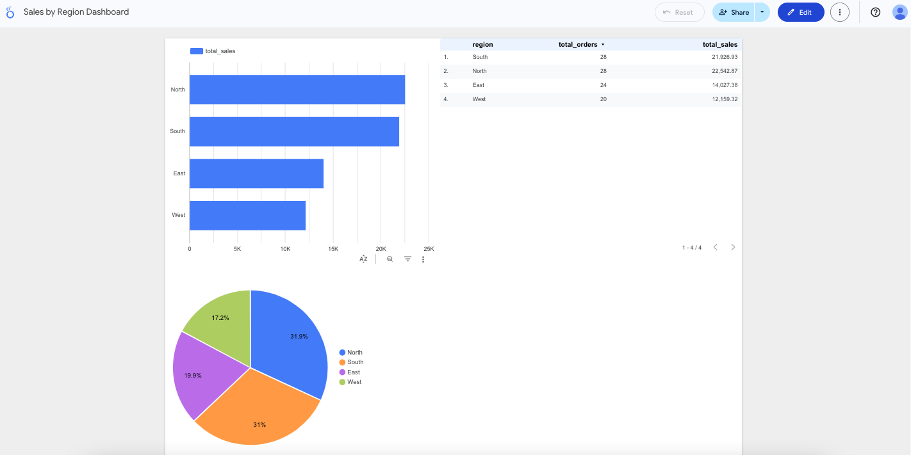

# Sales Analytics Pipeline – Modern Data Stack Project

This project demonstrates a complete **modern data stack pipeline** focused on *sales performance analytics*. It uses **dbt**, **BigQuery**, and **Looker Studio** to transform seed data into business-ready dashboards.

---

## 🚀 Project Overview

The pipeline:
- Uses **Mockaroo** seed files for customers, orders, and products.
- Transforms data in dbt using a layered structure:
  - **staging** → **intermediate** → **mart**
- Adds **schema tests** and **BI exposures** for traceability.
- Feeds directly into **Looker Studio dashboards** for insights.

The repo is structured to be easily extensible for future data sources (e.g., live NFL data via APIs).

---

## 🧱 Tech Stack

| Layer        | Tool               | Purpose                             |
|--------------|--------------------|-------------------------------------|
| Transformation | dbt              | Modular SQL models, tests, docs    |
| Storage      | BigQuery           | Cloud data warehouse               |
| Visualization| Looker Studio      | BI dashboards and insights         |
| Orchestration| dbt Cloud Jobs     | Build, test, and document pipeline |

---

## 📁 Project Structure

```
analytics-engineering-project/
├── dashboards/           # Links to final dashboards
├── dbt/
│   ├── dbt_project.yml   # dbt config
│   ├── models/
│   │   ├── staging/      # Clean and standardize raw data
│   │   ├── intermediate/ # Business logic & aggregations
│   │   └── marts/        # Final business-ready datasets
│   ├── seeds/            # Mockaroo CSVs
│   ├── tests/            # Schema tests
│   └── snapshots/        # (Optional) SCD handling
├── ingestion/            # Reserved for future ingestion scripts
├── models/nfl_models/    # Reserved for future NFL analytics
└── README.md
```
---

## 🗺️ Data Flow

```
flowchart LR
  Seeds[(seeds: customers, orders, products)]
  Seeds --> STG[staging models<br/>stg_customers, stg_orders, stg_products]
  STG --> INT[int models<br/>int_customers, int_order_summary, int_time_aggregates, int_products, int_inventory, int_sales_region, int_customer_segments]
  INT --> MART[marts<br/>mart_sales_by_region, mart_sales_by_product, mart_sales_by_customer, mart_sales_over_time, mart_inventory_summary]
  MART --> Dashboards[Looker Studio dashboards<br/>Sales by Region, Top Products, CLV, Revenue Trends]
```
---


## 📊 Dashboards

- 📍 [Sales by Region](https://lookerstudio.google.com/s/smFV5AAQiu0)
- 🛍️ [Top Products](https://lookerstudio.google.com/s/ppd2UBm7Rus)
- 👤 [Customer Lifetime Value](https://lookerstudio.google.com/s/hA7EA8bp_UQ)
- 📈 [Revenue Trends](https://lookerstudio.google.com/s/r7AqNyIFVGw)



---

## 🧪 dbt Features

- Layered architecture: **staging → intermediate → mart**
- Schema tests: `not_null`, `unique`, `accepted_values`
- Exposures linking mart models to dashboards
- Built-in documentation via `dbt docs generate`

---

## 📘 How to Run

```bash
dbt seed
dbt build
dbt docs generate
```
In dbt Cloud, run the Build, Test, and Docs job to execute this process automatically.

## 🧱 Future Enhancements

- **NFL player/team data ingestion via API** – Extend the project to pull real-time NFL training camp and roster data, integrate it into the same transformation pipeline, and produce sports analytics dashboards.
- **Airflow DAG orchestration** – Automate and schedule dbt runs using Apache Airflow, ensuring the data pipeline executes reliably on a set cadence with monitoring and alerting.
- **Snapshots for slowly changing dimensions** – Implement dbt snapshot models to track historical changes in dimension tables (e.g., customer information) for more accurate trend and retention analysis.

---

## 📜 License

MIT License – see [LICENSE](LICENSE) for details.

